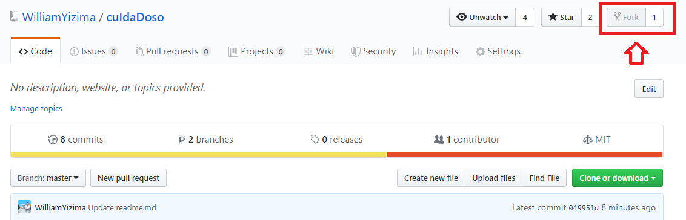
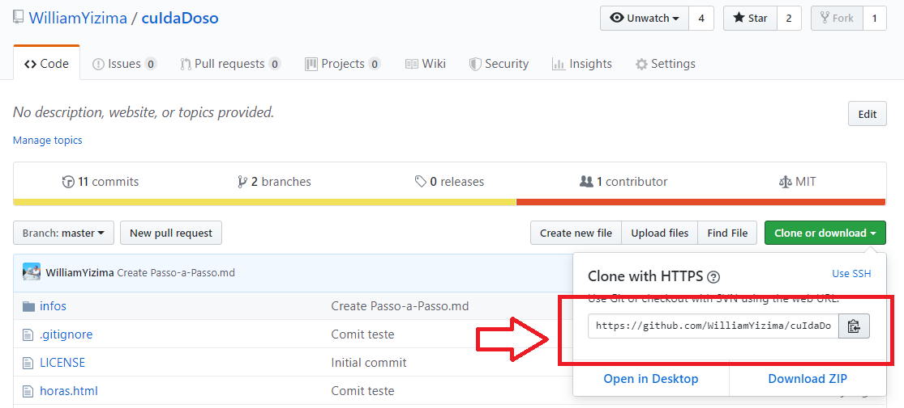
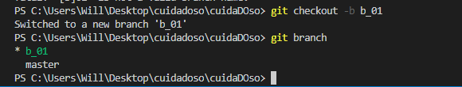

# 1. Inicio

Você pode estar:
- Fazendo uma [Nova Task](#11-Task)
- [Revisando Task](#11-Task) a TASK 

## 1.1 Task

### 1. Inicialmente você deverá com sua conta logada, fazer um FORK neste projeto principal, com isso você estará copiando para seu repositório.

### 2. Estando em seu repositório, utilize o botão para copiar a url e poder clonar pelo terminal:

### 3. No terminal, utilize os comandos:
- git init
- git clone (cole o caminho)
- cd (nome da pasta - no caso o nome da minha pasta é cuidaDOso)

### 4. Como boa prática, sempre inicie uma nova branch(ramificação):
- git checkout -b (nome da Branch)
**- o nome da branch por padrão vamos colocar f_01 (para task front 01) e b_01(para task back 01)**
- assim,foi criado uma nova ramificação (branch), porém verifique se você está na branch correta(que acabou de ser criada) com git branch:

### Após o processo, é possível trabalhar na TASK

### 5. Após todas as modificações e finalização na TASK, conforme as boas práticas faça:
- git add (nome do arquivo)
- git commit -m"Comentário sobre a modificação"
- **Repita o processo até que todos os arquivos sejam 'pré upados'** 
- Após upar todos os arquivos, veja com git status quais arquivos irão subir
- Para subir de fato, utilize o git push
